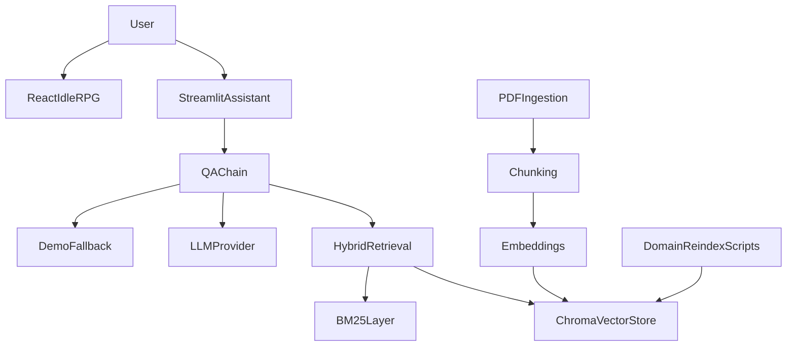
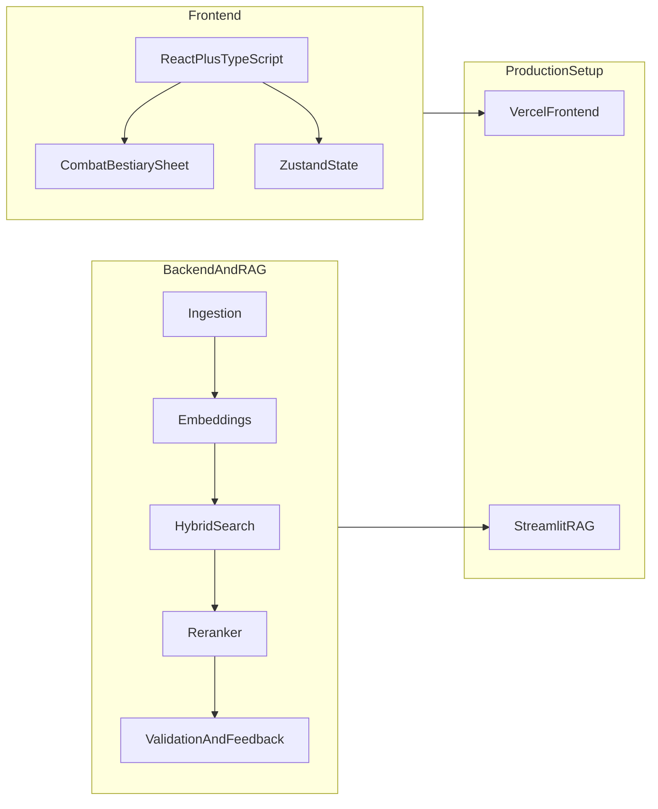

# RAG 3D&T + Idle RPG

AI-driven full-stack portfolio project combining a **RAG assistant for 3D&T** and a **React idle RPG frontend**.

Built to demonstrate production-oriented work for **ML / AI / RAG**, **Python backend**, **frontend**, and **full-stack** roles.

## TL;DR

- **Live frontend:** [rag3det.vercel.app](https://rag3det.vercel.app/)
- **Live Streamlit assistant:** [rag3det-mhqboqu9qgsccf3fxsbq8c.streamlit.app](https://rag3det-mhqboqu9qgsccf3fxsbq8c.streamlit.app/)
- **Domain:** 3D&T, a Brazilian tabletop RPG system
- **Core work:** PDF ingestion, chunking, embeddings, hybrid retrieval, reranking, domain reindexing, demo-safe cloud fallback
- **Delivery model:** AI-driven development workflow using Cursor as coding copilot, with product direction, architecture, validation, debugging, and integration decisions led by me

## Live Demos

- **Frontend game (Vercel):** [https://rag3det.vercel.app/](https://rag3det.vercel.app/)
- **RAG assistant (Streamlit):** [https://rag3det-mhqboqu9qgsccf3fxsbq8c.streamlit.app/](https://rag3det-mhqboqu9qgsccf3fxsbq8c.streamlit.app/)

Both are live.

## What This Project Is

- A **Python RAG backend** for 3D&T rules, monsters, advantages, items, and related game knowledge
- A **React + TypeScript idle RPG frontend** with character sheet, bestiary, items, and combat
- A portfolio-ready case of **AI-assisted software delivery**, from data extraction to deployment

## My Role

This project was developed with an **AI-driven coding workflow**, but the responsibilities were mine:

- product direction and feature definition
- software architecture and folder boundaries
- RAG design choices and data modeling
- debugging and production fixes
- deployment strategy for Vercel and Streamlit
- validation of code, flows, and output quality

In practice, I acted as:

- ML / RAG engineer
- Python backend developer
- React / TypeScript frontend developer
- game systems implementer
- technical product owner

## Tech Stack

- **Backend:** Python, Streamlit, FastAPI, LangChain, ChromaDB, sentence-transformers, BM25, SQLite
- **Frontend:** React 19, TypeScript, Vite, Zustand, Tailwind CSS
- **RAG techniques:** PDF ingestion, custom chunking, embeddings, hybrid retrieval, reranker, domain reindexing, answer validation, feedback loop

## System Overview



## Recruiter-Focused Architecture



## What Is Live Right Now

### Vercel

The Vercel app is the **game frontend**:

- bestiary
- character sheet
- items
- combat UI

### Streamlit

The Streamlit app is the **assistant**:

- tries the deployed RAG flow first
- if indexed chunks are unavailable in cloud, it falls back to a **demo knowledge mode** using versioned project data
- remains useful for portfolio and recruiter testing even without full Chroma/PDF rebuild in the cloud

## What The Chat Accepts Right Now

The chat currently works best for:

- monster lookup
- spell lookup
- fire-related spell queries
- advantages / disadvantages / race lookup
- item lookup
- simple greeting / smoke test prompts

## Example Chat Prompts

Use these exact examples in the live Streamlit app:

```text
Hi
```

```text
What are the fire spells?
```

```text
Abelha Feral Operária
```

```text
Fera Mãe
```

```text
What does Área de Batalha do?
```

```text
What does Aceleração do?
```

```text
What is Adaptador?
```

```text
What is the Katana item?
```

```text
What is Leather Armor used for?
```

```text
How does race work in this project?
```

## RAG Scope Implemented In The Codebase

- PDF ingestion pipeline
- custom text cleaning and chunking
- embedding pipeline with local and fine-tuned model support
- Chroma vector storage
- hybrid retrieval with semantic search plus BM25
- reranking with cross-encoder
- domain reindexing scripts for monsters, spells, items, advantages, rules, and character data
- feedback and answer validation flow
- production fallback strategy for cloud demo environments

## Why This Is Relevant For AI / RAG Roles

This repository demonstrates:

- shipping a RAG product, not just notebooks
- balancing local-first development with deploy constraints
- handling retrieval quality, data shape, and ranking
- making pragmatic production trade-offs
- using AI tools to accelerate delivery while still owning architecture, correctness, and releases

## Local Run

### Backend / Streamlit

```bash
pip install -r requirements.txt
python scripts/build_index.py
streamlit run streamlit_app.py
```

### Frontend

```bash
cd frontend
npm install
npm run build
npm run dev
```

## Repository Structure

- `src/` — backend, RAG, retrieval, evaluation, utilities
- `app/` — Streamlit assistant UI
- `frontend/` — React game frontend
- `scripts/` — ingestion, reindexing, evaluation, training helpers
- `docs/` — supporting technical notes and study material

## Notes

- The Streamlit deployment is optimized for **portfolio availability**, not for full cloud-side index rebuilding
- The frontend and assistant are intentionally split so each can be tested live with low friction
- The codebase reflects an **AI-assisted build process**, but the engineering ownership, direction, validation, and deployment decisions were mine

