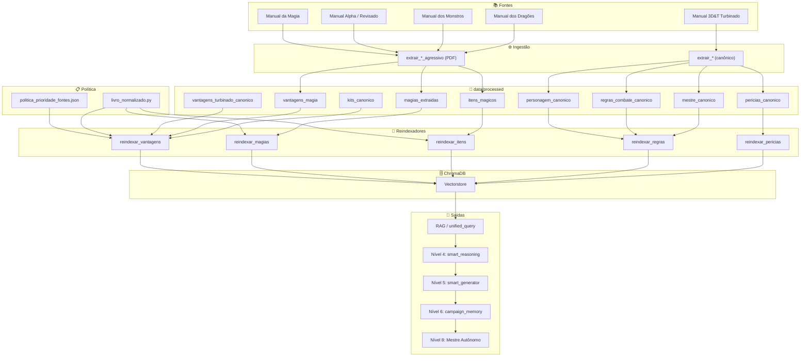

# Sistema 3D&T – Visão geral e o que fazer agora

## Terminou?

**Sim.** O pipeline está implementado do **Nível 1 ao Nível 8**: ingestão, RAG, raciocínio, geração, memória de campanha, multimodal (imagens/PDF) e **Mestre Autônomo** com interface web. Tudo que foi pedido nas conversas está no código; o que falta é evolução (mais dados, fine-tuning, integrações externas).

---

## Como estamos no sistema (arquitetura em níveis)

| Nível | Módulo | O que faz |
|-------|--------|-----------|
| **1–3** | Ingestão, vectorstore, RAG base | PDFs → tabelas → chunks → ChromaDB; buscas semânticas; `unified_query` como ponto único de consulta. |
| **4** | `smart_reasoning` | Analisa intenção (busca entidade, comparação, gerar NPC/encontro), extrai entidades e parâmetros. |
| **5** | `smart_generator` | Gera NPCs e encontros usando cache de entidades (tabelas 3D&T) e contexto da party. |
| **6** | `campaign_memory` | Campanhas persistentes: sessões, eventos, personagens, combates, resumos, sugestões de callback. |
| **7** | `visual_system_3dt` | Extrai imagens de PDFs, classifica (mapa, ficha, ilustração), OCR de fichas, descrições textuais de mapas. |
| **7.5** | `sistema_multimodal_3dt` | Integra texto + visual: consultas “mostre imagem do goblin”, “descreva o mapa”, análise tática, indexação de PDFs. |
| **8** | `master_autonomo_3dt` | Mestre autônomo: cria campanha, prepara sessões (cenas combate/social/exploração), narra, processa ações, `executar_sessao_completa()` para demo. Usa `regras_3dt` (CD por dificuldade, atributos F/H/R/A) com saída em termos legíveis (Força, Habilidade, Classe de Dificuldade, etc.). |

**Fluxo de dependência:**  
1–3 → 4+5 (reasoning + generator usam entity_cache dos chunks) → 6 (campanha) → 7 (visual) → 7.5 (multimodal) → 8 (mestre que usa o sistema completo).

---

## O que é possível fazer agora

### 1. Interface web do Mestre Autônomo (Streamlit)

- **Comando:** na raiz do projeto  
  `streamlit run app.py`
- **O que faz:** sidebar para configurar campanha (estilo, duração, jogadores, nível, tema) → “Criar Campanha” → mundo criado, Sessão 1 iniciada, narração na tela → você digita ações e o mestre responde (combate/social/exploração).

### 2. API REST (FastAPI)

- **Comando:** `uvicorn src.api.main:app --reload` (ou como estiver no `app/`).
- **O que faz:** endpoints para query, NPC, encontro, sessão, combate, regras, entidade, comparar, health; criar sessão e adicionar personagem; integração com o mesmo backend (RAG, campanha, etc.).

### 3. Demo em linha de comando (Mestre Autônomo)

- **Comando:** `python -m src.master.master_autonomo_3dt`
- **O que faz:** cria campanha, prepara Sessão 1, mostra introdução, processa uma ação de teste e exibe a decisão do mestre.

### 4. Executar uma sessão inteira automática (demo)

- No código Python:
  - Criar mestre e campanha.
  - Chamar `mestre.executar_sessao_completa(1)`.
- **O que faz:** 3 cenas com ações simuladas (investigar, atacar, falar), decisões do mestre e finalização da sessão.

### 5. Consultas RAG / sistema completo (sem mestre)

- **Sistema completo (4–6):** `python -m src.rag.sistema_completo_3dt` → consultas tipo “goblin”, “crie encontro médio para 4 jogadores”, “quanto XP para nível 3?”.
- **Multimodal (7.5):** usar `SistemaMultimodal3DT` e `consultar(..., incluir_visuais=True)` para perguntas que envolvem imagens/mapas (quando houver PDF indexado em `data/raw/`).

### 6. Extração visual de PDFs (Nível 7)

- Colocar PDF do 3D&T em `data/raw/` (ex.: `3det_manual.pdf`).
- Rodar:
  - `python -c "from src.multimedia.visual_system_3dt import VisualProcessor3DT; p = VisualProcessor3DT(); p.processar_pdf('data/raw/3det_manual.pdf')"`
- **O que faz:** extrai imagens, classifica, gera descrições de mapas e (com Tesseract) OCR de fichas; saída em `data/visual/`.

### 7. Outros demos e scripts

- `tests/demo_nivel4_nivel5.py` – reasoning + generator.
- `tests/demo_sistema_completo.py` – sistema completo.
- `scripts/compare_old_vs_new.py` – comparação de buscas.
- `python -m src.rag.hybrid_retriever` – retriever híbrido.

---

## Resumo rápido

| Pergunta | Resposta |
|----------|----------|
| **Terminou?** | Sim, do Nível 1 ao 8 (incluindo Mestre Autônomo e interface web). |
| **O que dá para fazer agora?** | Jogar pela interface Streamlit (`app.py`), usar a API, rodar demos em CLI, executar sessão completa automática, indexar PDFs visuais e fazer consultas multimodais. |
| **Como estamos no sistema?** | Pipeline em 8 níveis (ingestão → RAG → reasoning → generator → campanha → visual → multimodal → mestre); tudo integrado e acionável por `app.py`, API ou scripts. |

Próximos passos possíveis (evolução, não “falta para terminar”): mais PDFs/livros em `data/raw/` e `data/books/`, fine-tuning de embeddings/reranker, conectar LLM externo na geração, e expandir a UI (mapas, fichas, combate passo a passo).

**Inventários:** Mestre (`INVENTARIO_MESTRE.md`), Personagem (`INVENTARIO_PERSONAGEM.md`), Regras de Combate (`INVENTARIO_REGRAS_COMBATE.md`), Poder de Gigante (`INVENTARIO_PODER_GIGANTE.md`), Magias (`INVENTARIO_MAGIAS.md`), Itens mágicos (`INVENTARIO_ITENS_MAGICOS.md`), Vantagens/Desvantagens/Kits (`INVENTARIO_VANTAGENS_DESVANTAGENS_KITS.md`), Perícias (`INVENTARIO_PERICIAS.md`), Monstros (`INVENTARIO_MONSTROS.md`). Ver também `ANALISE_SISTEMA_E_LIVROS.md` para lacunas e recomendações.
